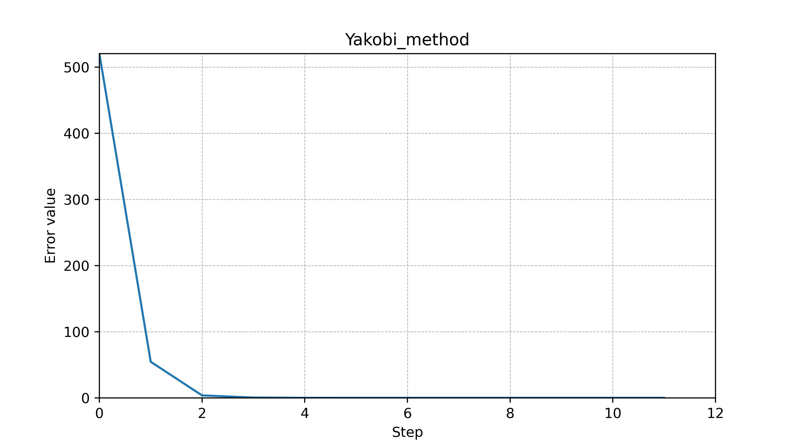
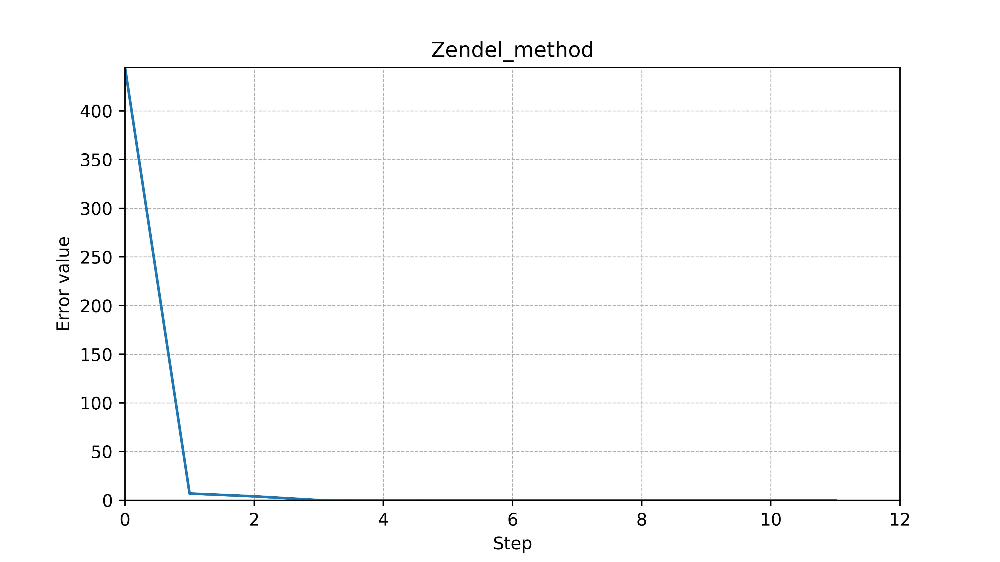

# Report of laba 2

## Methodology

Various methods can be used to solve linear equations, and methods are given in this paper:

The accuracy criterion for all iterative methods is selected as $1 \cdot 10^{-8}$.

This work also uses Gauss and LU decomposition methods.

#### System of equations:

$$
\begin{flalign}
&
  \begin{cases} 
  x_1 + x_2 + x_3 ... = 100 \\
  x_1 + 10 x_2 + x_3 = 99 \\
  x_2 + 10 x_3 + x_4 = 98 \\
  ... \\
  x_99 + x_100 = 1 \\
  \end{cases}
&
\end{flalign}
$$

#### Conclusion:

| Method     |             Error rate              | Iteration number |
| :--------- | :---------------------------------: | :--------------: |
| Gauss      | $\sigma_G    = 1.49 \cdot 10^{-13}$ |        1         |
| LU         | $\sigma_{LU} = 8.47 \cdot 10^{-14}$ |        1         |
| Zendel     | $\sigma_{Z}  = 1.80 \cdot 10^{-9}$  |        12        |
| Yakobi     | $\sigma_{Y}  = 2.19 \cdot 10^{-9}$  |        12        |
| Relaxation | $\sigma_{R}  = 8.22 \cdot 10^{-9}$  |        54        |

$$
\begin{flalign}
  & \text{If } b = Ax, \text{than}: &
\end{flalign}
$$

$$
\begin{flalign}
  & \text{Error rate(norm)}  = E_i = \parallel b - Ax_{i}\parallel_{3} = \sqrt{((b - Ax_{i}) \cdot (b - Ax_{i}))} = \sqrt{\sum_{k} \zeta_k^2} &
\end{flalign}
$$

$$
\begin{flalign}
  & k, i \in \mathbb{N} &
\end{flalign}
$$

#### Results

