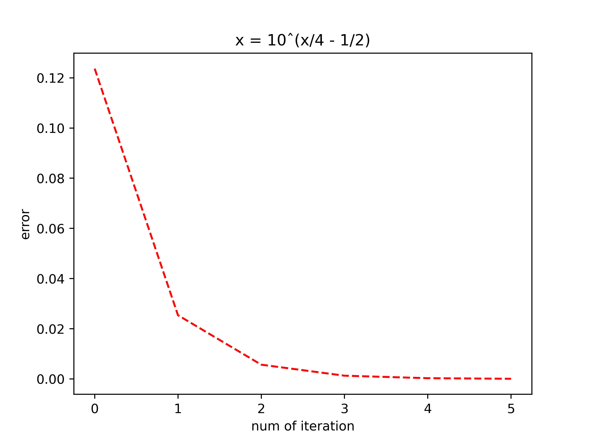

# 3 lab
## Theory
In this lab we practiced fixed point iteration and Newton iteraton methods for solving a non-linear equation and system of its:

### Non-linear equation:

$$ F(x) = 2lg(x) - x/2 + 1 $$

### By fixed point iteration:

1) I localized all solutions using theorem of intermidiate value, using LocalizeZeros(). Example of my function output:

2) Then I determine iteration that converges ($f'(x) < 1$ on all points of the given interval): 
For my equation I have two iterations:

$$ x_{k+1} = \abs{4*lg(x_{k}) + 2} $$
$$ x_{k+1} = 10ˆ(\frac{x}{4} - \frac{1}{2}) $$

In code, they are chosen autamaticly, using FindCompressiveIteration(), for each interval.

3) Iterated until $$\abs{F(x_{k+1})} < precision $$:
$$ x_{1} = 0.3975 $$
$$ x_{2} = 4.68143 $$

4) MPI errors below:

### Nuton method:
1) To check if Nuton method converges or not, functon IsNutonIterationValid() was written. 
It checks few properties of F(x) on the given interval:
- F'(x) != 0
- F'(x) - continious
- F''(x) - does not change its sign

$$ F(x) = 0 $$
$$ x_{k+1} = x_{k} - \frac{F(x_k)}{F'(x_k)} $$

$$ x_{1} = 0.39754 $$
$$ x_{2} = 4.68156 $$

### System of non-linear equations

$$ \overline{x_{k+1}} = \overline{x_k} - J^{-1}(\overline{x_k}) f(\overline{x_k})$$

$$x = 3.35, y = -1.207$$

